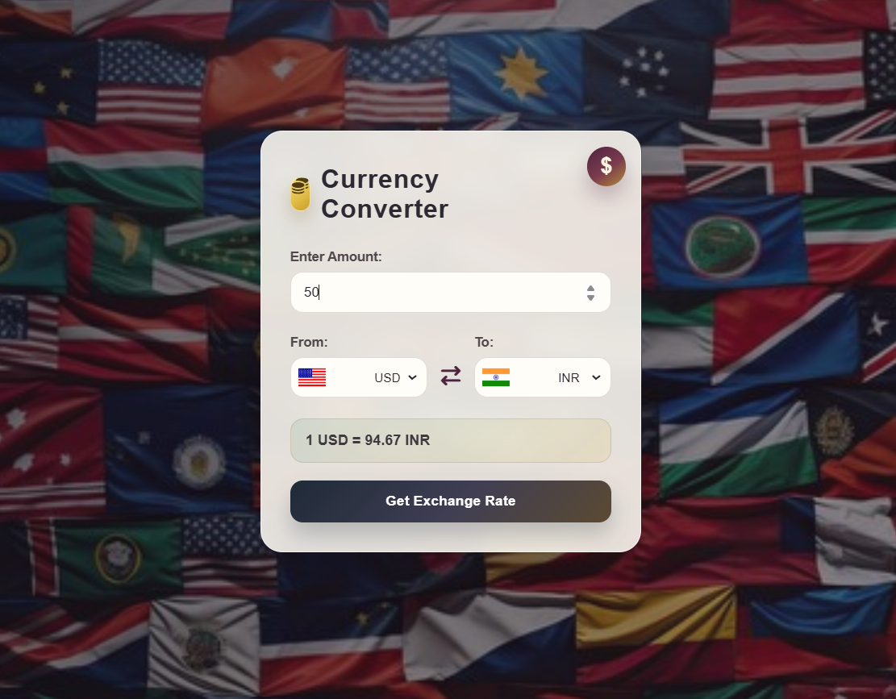

# Currency-Converter-
A responsive currency converter that converts amounts between different currencies using live exchange rates fetched from an API.
## Features

- 🌍 Convert between multiple currencies
- 💹 Real-time exchange rates
- 🏳️ Dynamic country flags
- ⚡ Fast API integration
- 🔄 Instant currency conversion

## 🛠️ Tech Stack

- HTML5
- CSS3
- JavaScript (ES6)
- Currency API
- Flags API

---

## 📸 Preview




---


## 🌐 APIs Used

### Currency Exchange API

```
https://cdn.jsdelivr.net/npm/@fawazahmed0/currency-api@latest/v1/currencies
```

### Country Flags API

```
https://flagsapi.com/
```

---

## ▶️ How to Run

1. Clone the repository

```bash
git clone https://github.com/your-username/currency-converter.git
```

2. Open the project folder.

3. Run `index.html` in your browser.

## 📌 Future Improvements

- Currency swap button
- Searchable currency dropdown
- Conversion history
- Dark mode
- Favorite currencies
- Better UI animations
